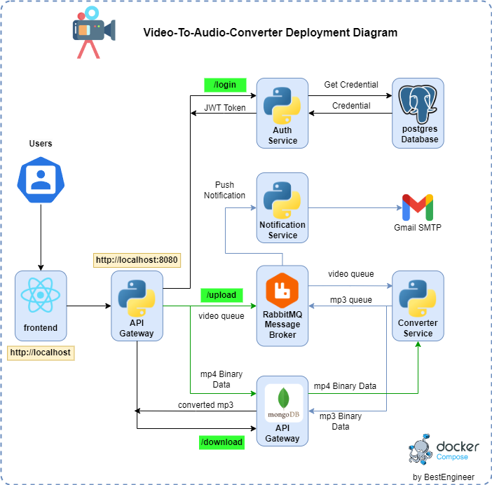

# Devops Project: video-converter
Converting mp4 videos to mp3 in a microservices architecture.

## Software Architecture

<p align="center">
  
  </p>

## Installation (Production)
run in terminal

```bash
docker compose -f .\docker-compose-prod.yml up
```

## Installation (Development Build)
run in terminal

```bash
docker compose up
```

## Accessing Application (Local)
[Frontend => http://localhost](https://localhost){:target="_blank" rel="noopener"}

[Gateway => http://localhost:8080](https://localhost:8080){:target="_blank" rel="noopener"}

## Accessing Application (Global)

Not Available